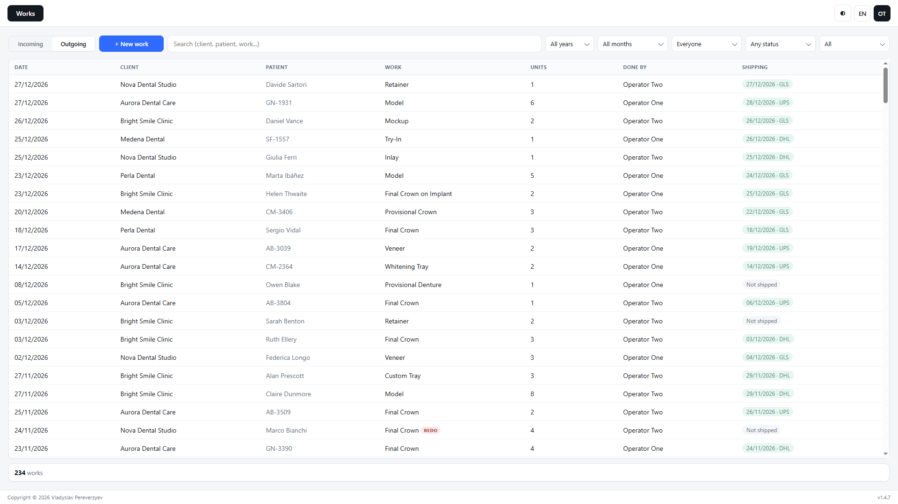

# Lab Ledger

[](https://github.com/vladpereverzyev/lab-ledger/releases/latest)
[](https://github.com/vladpereverzyev/lab-ledger/releases)
[](https://github.com/vladpereverzyev/lab-ledger/blob/main/LICENSE)

[](#github-api)

[](https://github.com/vladpereverzyev/lab-ledger/blob/main/README.md)
[](https://github.com/vladpereverzyev/lab-ledger/blob/main/README.it.md)
[](https://github.com/vladpereverzyev/lab-ledger/blob/main/README.es.md)
[](https://github.com/vladpereverzyev/lab-ledger/blob/main/README.fr.md)
[](https://github.com/vladpereverzyev/lab-ledger/blob/main/README.de.md)

**Lab Ledger** est une application de bureau gratuite pour les laboratoires
dentaires. Elle suit chaque travail de son arrivée à son expédition, calcule le
coût des matériaux à partir des prix réels des lots et montre le bénéfice qui
reste après les charges fixes et les impôts.

Elle fonctionne sous Windows, macOS et Linux, même sans internet, et garde
toutes les données sur votre ordinateur.

[**Télécharger**](https://github.com/vladpereverzyev/lab-ledger/releases/latest) · [**Démo**](https://vladpereverzyev.github.io/lab-ledger/) · [**Nouveautés**](https://github.com/vladpereverzyev/lab-ledger/blob/main/CHANGELOG.md)

## Pourquoi Lab Ledger ?

- **Un vrai programme de bureau** : il s'installe comme les autres, fonctionne
  sans connexion et ne demande aucune inscription.
- **Privée par conception** : les données restent sur votre ordinateur. Aucune
  donnée de patient ou de client n'est livrée dans le code : vous saisissez les
  vôtres en local et les sauvegardez dans des fichiers quand vous le voulez.
- **Des coûts réels** : un matériau s'achète par lot et ce lot donne un certain
  nombre d'unités utilisables. La division donne le coût d'une unité. Chaque
  type de travail déclare ce qu'il consomme : changez le prix d'un lot et tous
  les travaux qui l'utilisent suivent.
- **La vue complète** : pas seulement la marge brute. Loyer, énergie, assurance,
  comptable, personnel et impôts entrent aussi, pour que l'application réponde à
  la seule question qui compte : que reste-t-il, par an, par mois, par jour
  travaillé.

## Captures

Premier démarrage : les coordonnées du laboratoire et le compte administrateur, rien d'autre à configurer.


Travaux : chaque travail avec patient, expedition, cout materiau, prix et marge.


Le même écran en clair, qui est le mode par défaut :


Resume : l'annee en cartes, en graphiques et en compte de resultat.


Catalogue : chaque type de travail relie aux materiaux qu'il consomme.


Entrants : le travail encore sur l'établi, qui ne compte pas tant qu'il n'est pas marqué terminé.


Utilisateurs : ce que chaque opérateur a le droit de faire, modifiable à tout moment.


Réglages : mises à jour, copie Excel automatique et code de récupération.


## Fonctionnalités

### Travaux
- Enregistrez chaque travail : date, client, **patient** (nom complet ou une référence), type de
  travail, unités, qui l'a réalisé, et s'il est facturable ou en **reprise**.
- **Une reprise est une perte, et elle est comptée comme telle.** Elle n'est
  jamais facturée : elle consomme le matériau et ne rapporte rien, donc la
  colonne du prix affiche le coût matériau en négatif et la marge baisse
  exactement d'autant.
- **Expédition** : marquez un travail expédié avec sa date, son transporteur et
  son numéro de suivi. Filtrez par expédiés / à expédier.
- **Entrants et Sortants** : le travail encore sur l'établi attend dans Entrants
  et ne compte pas encore ; marquez-le terminé et il passe dans Sortants, où il
  rapporte et s'expédie.
- **Un colis, plusieurs travaux** : cochez plusieurs travaux et expédiez-les
  ensemble avec une seule date, un transporteur et un numéro de suivi.
- **Supprimer n'est pas détruire** : un travail supprimé quitte les listes et
  les totaux mais reste dans une archive à l'intérieur du fichier de données,
  donc aussi dans les sauvegardes.
- Recherchez sur client, patient, travail, opérateur, transporteur et suivi ;
  filtrez par année, mois, opérateur, expédition et reprise.

### Qui s'en sert
- **Au premier démarrage**, le programme demande les données du laboratoire et
  crée l'administrateur. Ensuite l'application s'ouvre sur un écran de connexion.
- **Les opérateurs** se connectent avec leur propre nom et mot de passe, et ne
  voient et ne font que ce que l'administrateur permet : voir [Rôles et permissions](#rôles-et-permissions).
- **Les mots de passe ne sont jamais enregistrés** : seulement PBKDF2-SHA256 sur
  un sel aléatoire par utilisateur, 150000 tours. Un mot de passe oublié se
  réinitialise, il ne se récupère pas.
- **Un mot de passe d'administrateur oublié ne ferme pas l'archive.** La
  configuration produit un **code de récupération**, affiché une fois pour être
  noté, qui réinitialise le mot de passe de l'administrateur depuis l'écran de
  connexion. Une copie reste dans le dossier de données de l'application sur cet
  ordinateur, pour pouvoir être lue au téléphone, et l'administrateur la
  retrouve dans **Catalogue > Réglages** quand il veut. Le fichier de données à
  côté est du JSON en clair : le code n'est pas plus exposé que l'archive où il
  vous ramène, et tous deux sont protégés par qui a le droit d'utiliser cet
  ordinateur.
- **L'historique** enregistre chaque modification avec qui et quand.
  L'administrateur le lit dans Catalogue > Historique.

### Résumé
- Cartes d'activité : travaux, unités, recettes, coût matériaux, marge brute,
  reprises et ce qu'elles ont coûté.
- Des graphiques, tous construits sur vos vraies lignes : recettes et coût
  matériaux par mois (aire), marge par mois (barres, rouges quand le mois perd),
  bénéfice cumulé face à la ligne des charges fixes, travaux les plus rentables
  (barres horizontales), part des recettes par client (anneau), travaux par
  opérateur répartis facturables / reprises (barres empilées), les types de
  travaux de chaque opérateur (barres empilées) et où vont les
  recettes (barre empilée : matériaux, charges fixes, impôts, ce qui reste).
- Cartes de rentabilité : charges fixes, impôts et cotisations, bénéfice net et
  le bénéfice **par jour travaillé, par semaine, par mois**, la moyenne par
  travail et les recettes nécessaires rien que pour atteindre l'équilibre.
- Un tableau de **compte de résultat** avec chaque poste par an, par mois, par
  jour travaillé et en pourcentage des recettes.

### Catalogue
- **Clients** : nom, email, téléphone, numéro de TVA, adresse, notes.
- **Matériaux** : coût du lot, unités par lot, unité, note. Le coût unitaire est
  la division, et il est affiché sur la ligne.
- **Types de travaux** : chacun liste les matériaux qu'il utilise et en quelle
  quantité. Le coût matériau est calculé, jamais saisi, et la marge et la marge %
  viennent avec.
- **Opérateurs** et **transporteurs** : des listes courtes où l'on choisit.
- **Charges fixes** : local (loyer, prêt, charges), énergie (électricité, gaz,
  eau), assurance, comptable, personnel et tout le reste, mensuel ou annuel,
  avec le montant annuel et mensuel sur chaque ligne.
- **Impôts et calendrier** : régime forfaitaire ou réel avec des pourcentages
  simples, plus combien de jours par semaine et de semaines par an le
  laboratoire travaille vraiment : c'est ce qui transforme un bénéfice annuel en
  bénéfice journalier.
- **Réglages** : recherche de mises à jour activée ou non, la copie Excel
  automatique, le code de récupération, version, licence
  et chemin du fichier de données ; réservés à l'administrateur.
- **Utilisateurs** et **Historique** : comptes et permissions, et chaque
  modification avec son auteur ; réservés à l'administrateur.

### Partout
- **Importer / Exporter** : export Excel des travaux, du résumé par type, du
  catalogue et des charges fixes ; import Excel des travaux, depuis votre propre
  feuille ou un fichier écrit par Lab Ledger ; sauvegardes complètes, en clair
  ou **chiffrées par mot de passe** (AES-256-GCM), restaurables sur n'importe
  quel ordinateur. Restaurer une sauvegarde remplace aussi les comptes : seul
  l'administrateur peut le faire.
- **Cinq langues**, et changer de langue ne déplace pas la barre d'outils :
  chaque commande a une largeur fixe.
- **S'adapte à l'écran** : sur téléphone, chaque ligne du tableau devient une
  carte dont chaque valeur porte le nom de sa colonne.
- **Une seule liste déroulante** pour tous les choix, au lieu de celle que
  chaque système dessine à sa façon.
- **Un seul format de nombres dans toutes les langues** : 1.234,56 €, un point
  pour les milliers, une virgule pour les décimales, l'euro après.
- **Clair par défaut**, sombre en un clic, mémorisé par ordinateur.

## Rôles et permissions

Lab Ledger a deux rôles.

**Administrateur** : la personne qui a configuré le laboratoire. Voit et fait
tout : prix et bénéfices, tout le catalogue, les utilisateurs et leurs
permissions, l'Historique, les Réglages, les sauvegardes et leur restauration.
Si le mot de passe est perdu, le code de récupération en définit un nouveau.

**Opérateur** : tous les autres. Chaque opérateur se connecte avec son propre
nom et mot de passe, et l'administrateur coche ce qu'il peut faire, dans
**Catalogue > Utilisateurs**, à tout moment :

| Permission | Ce qu'elle ouvre |
|---|---|
| **Voir prix et bénéfices** | Les colonnes coût, prix et marge et leurs totaux dans Travaux, l'onglet Résumé, les coûts des matériaux, les charges fixes et les impôts |
| **Ajouter de nouveaux travaux** | Le bouton **+ Nouveau travail**, et l'import Excel avec Exporter |
| **Modifier les travaux existants** | Changer un travail déjà enregistré, cocher des travaux, **Marquer terminé** et **Expédier ensemble** |
| **Supprimer des travaux** | Supprimer un travail (il reste dans l'archive du fichier de données) |
| **Modifier le catalogue** | L'onglet Catalogue : clients, types de travaux et leurs matériaux, matériaux, opérateurs et transporteurs |
| **Exporter et sauvegarder** | Exporter Excel, Sauvegarde et Sauvegarde chiffrée - seulement avec Voir prix et bénéfices, car tout export contient les prix |

Sans **Voir prix et bénéfices**, aucun montant n'apparaît à l'écran, et sans
**Modifier le catalogue**, l'onglet Catalogue n'apparaît pas : les clients et
types de travaux nécessaires se choisissent dans la fiche du travail.
**Utilisateurs**, **Historique**, **Réglages** et **Importer sauvegarde** ne
dépendent d'aucune case : ils sont à l'administrateur.

Un nouvel opérateur commence avec **Ajouter de nouveaux travaux** seulement :
quelqu'un à l'établi qui enregistre ses travaux et ne voit rien de l'argent.



Configurations typiques :

- **Technicien** : Ajouter de nouveaux travaux, plus Modifier les travaux
  existants s'il les marque aussi terminés et les expédie.
- **Accueil** : Ajouter de nouveaux travaux, Modifier les travaux existants et
  Modifier le catalogue, pour tenir à jour clients et transporteurs, toujours
  sans voir l'argent.
- **Associé ou responsable** : toutes les permissions ; seuls Utilisateurs,
  Historique, Réglages et la restauration des sauvegardes restent à
  l'administrateur.

Les permissions sont vérifiées par l'application elle-même, pas seulement en
cachant des boutons. Elles protègent les écrans de l'application, pas le fichier
de données sur le disque : voir [SECURITY.md](https://github.com/vladpereverzyev/lab-ledger/blob/main/SECURITY.md).

## Hors ligne par conception

Lab Ledger n'a pas besoin d'internet pour fonctionner. Les données vivent dans un
fichier JSON sur votre ordinateur : pas de compte, pas de serveur, pas de
télémétrie, et rien de ce que vous saisissez n'est jamais envoyé nulle part. La
seule façon dont une copie quitte l'ordinateur, c'est vous qui la choisissez :
placer la copie Excel automatique dans un dossier synchronisé par votre cloud, et
l'application vous prévient avant de l'écrire.

L'application se connecte pour une seule raison : **les mises à jour**. Elle
interroge alors l'API REST publique de GitHub, et seulement dans ces trois cas :

- **la vérification automatique** : au plus une fois par jour, au démarrage, si
  elle est activée. Elle l'est par défaut ; désactivez-la dans
  **Catalogue > Réglages** ;
- **la vérification à la main** : quand vous cliquez sur le numéro de version en
  bas à droite de la fenêtre ;
- **le téléchargement** : quand vous appuyez sur **Télécharger** dans la fenêtre
  des mises à jour.

Aucun des trois n'envoie de compte, d'identifiant ni rien de vos travaux, clients
ou patients. Sans connexion, l'application ne voit simplement pas les nouvelles
versions ; tout le reste fonctionne pareil. Les détails sont dans
[GitHub API](#github-api).

## La copie Excel automatique

**Ce que c'est.** Un fichier Excel ordinaire (.xlsx) avec tous les chiffres du
laboratoire, que Lab Ledger réécrit tout seul à chaque ouverture et à chaque
fermeture de l'application. Elle reste désactivée tant que vous ne l'activez pas
dans **Catalogue > Réglages** en choisissant où enregistrer le fichier.

**À quoi ça sert.** À voir les chiffres sans l'application. N'importe qui peut
ouvrir le fichier - avec Excel, Google Sheets, LibreOffice ou Numbers, sur un
ordinateur ou un téléphone - sans rien installer.

**La partager par le cloud.** Enregistrez le fichier dans un dossier que
OneDrive, Google Drive ou Dropbox synchronise déjà, et ce service envoie tout
seul chaque nouvelle version : ceux qui ont accès au dossier - votre comptable,
un associé - trouvent toujours les chiffres à jour. Lab Ledger n'envoie rien
lui-même : il écrit seulement le fichier sur votre ordinateur, et l'envoi est
fait par votre service cloud. Comme le fichier contient toutes les données,
l'application vous demande de confirmer avant de commencer à l'écrire.

**Elle ne va que dans un sens.** Le fichier est une copie à lire. Les
modifications qu'on y fait ne reviennent pas dans Lab Ledger et sont écrasées la
prochaine fois que l'application écrit le fichier. Pour faire entrer dans
l'application des lignes d'un tableur, utilisez **Importer Excel**, qui les
ajoute comme nouveaux travaux.

**Ce qu'il contient.** Huit feuilles : travaux, l'année mois par mois, matériaux
avec le coût d'une unité, types de travaux avec leurs matériaux et leurs prix,
charges fixes, cabinets, opérateurs, et une feuille Info avec la version. Des
valeurs seulement - ni macros, ni formules - et des largeurs de colonnes déjà
réglées, pour qu'il se lise pareil dans tous les programmes. Les en-têtes sont
en italien quand l'application est en italien, en anglais sinon.

## Langues

L'interface est disponible en **anglais, italien, espagnol, français et
allemand** : basculez avec le bouton de langue de la barre. Ajouter une langue
est une contribution de traduction uniquement : voir
[CONTRIBUTING.md](https://github.com/vladpereverzyev/lab-ledger/blob/main/CONTRIBUTING.md).

## GitHub API

[](https://docs.github.com/rest)

Lab Ledger utilise l'**API REST GitHub** pour une seule chose : vous dire qu'une
version plus récente existe.

| | |
|---|---|
| Endpoint | `GET /repos/vladpereverzyev/lab-ledger/releases/latest` |
| Version de l'API | `X-GitHub-Api-Version: 2022-11-28` |
| Authentification | aucune : l'API publique non authentifiée |
| Limite d'appels | les 60 par heure et par IP de l'API publique ; l'application demande au plus une fois par jour |
| Ce qui est envoyé | la requête et un `User-Agent` `LabLedger/<version>`. Pas de compte, pas d'identifiant, rien de vos travaux, clients ou patients |
| Ce qui est reçu | le tag de la dernière version, l'URL de sa page et les noms de ses fichiers |
| Ensuite | le tag est comparé à la version installée ; s'il est plus récent, une fenêtre s'ouvre. Sur **Télécharger**, l'application récupère elle-même l'installateur adapté à votre système dans le dossier Téléchargements, le vérifie avec les sommes SHA-256 publiées avec la version (un fichier qui ne correspond pas est supprimé) et propose de le lancer. Sans ce bouton, elle ne télécharge et n'installe rien |

La vérification automatique se désactive dans **Catalogue > Réglages**.
Désactivée, l'application ne se connecte que lorsque vous cliquez sur le numéro
de version en bas à droite de la fenêtre pour vérifier à la main, ou sur
**Télécharger**. Les Réglages indiquent aussi la version installée et la version
de l'API GitHub utilisée.

GitHub et le logo GitHub sont des marques de GitHub, Inc. Lab Ledger est un
projet indépendant, sans affiliation, parrainage ni approbation de
GitHub.

## Où sont stockées les données

Vos données vivent dans un unique fichier JSON local, dans le dossier de données
de l'application - le chemin exact est indiqué dans **Catalogue > Réglages**.
Rien n'est envoyé nulle part. Utilisez **Sauvegarde** ou **Sauvegarde chiffrée**
pour en garder une copie et **Importer sauvegarde** pour la restaurer.

Chaque enregistrement passe d'abord par un fichier temporaire qui remplace
ensuite l'ancien : un plantage ou une coupure de courant en plein milieu laisse
l'archive précédente intacte. Si un jour le fichier est illisible, l'application
le met de côté sans y toucher, avec son code de récupération, et vous dit où,
au lieu de repartir de zéro par-dessus.

## Lancer depuis les sources

Nécessite [Node.js](https://nodejs.org/) 22.12 ou plus récent.

```bash
npm install
npm start
```

## Compiler

```bash
npm run dist
```

Les installeurs sont produits dans le dossier `release/` : installeur NSIS et
`.exe` portable sous Windows, `.dmg` et `.zip` universels sous macOS (Intel et Apple Silicon), `AppImage` et `.deb`
sous Linux.

Les icônes se régénèrent depuis `build/icon.svg` avec
[Pillow](https://pillow.readthedocs.io/) :

```bash
python -m pip install pillow
python build/make-icons.py
```

## Technique

- [Electron](https://www.electronjs.org/) - coque de bureau
- [Chart.js](https://www.chartjs.org/) - graphiques (embarqués, sans CDN)
- [SheetJS](https://sheetjs.com/) - import/export Excel
- [API REST GitHub](https://docs.github.com/rest) - recherche de mises à jour

## Contribuer

Les contributions sont bienvenues, surtout les traductions. Voir
[CONTRIBUTING.md](https://github.com/vladpereverzyev/lab-ledger/blob/main/CONTRIBUTING.md).

## Licence

Lab Ledger est **source-available**, pas open source : libre d'usage dans votre
propre laboratoire, pas libre à la revente. La
[Business Source License 1.1](https://github.com/vladpereverzyev/lab-ledger/blob/main/LICENSE) s'applique.

- **Tout laboratoire dentaire ou cabinet peut l'utiliser en production,
  gratuitement** - sur autant de postes et de sites qu'il veut.
- **Une licence commerciale est nécessaire** pour fournir Lab Ledger, ou une
  version modifiée, à des tiers contre paiement : comme produit, comme service
  hébergé, avec du matériel ou intégré à un autre logiciel. Écrivez à
  <info@vladpereverzyev.com>.
- **Le 2030-09-14 cette version devient Apache 2.0** automatiquement. Chaque
  publication porte sa propre date, quatre ans après sa sortie.
