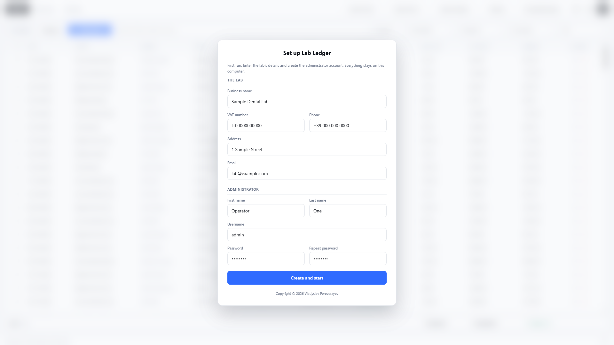
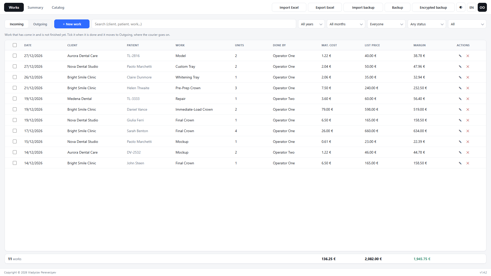
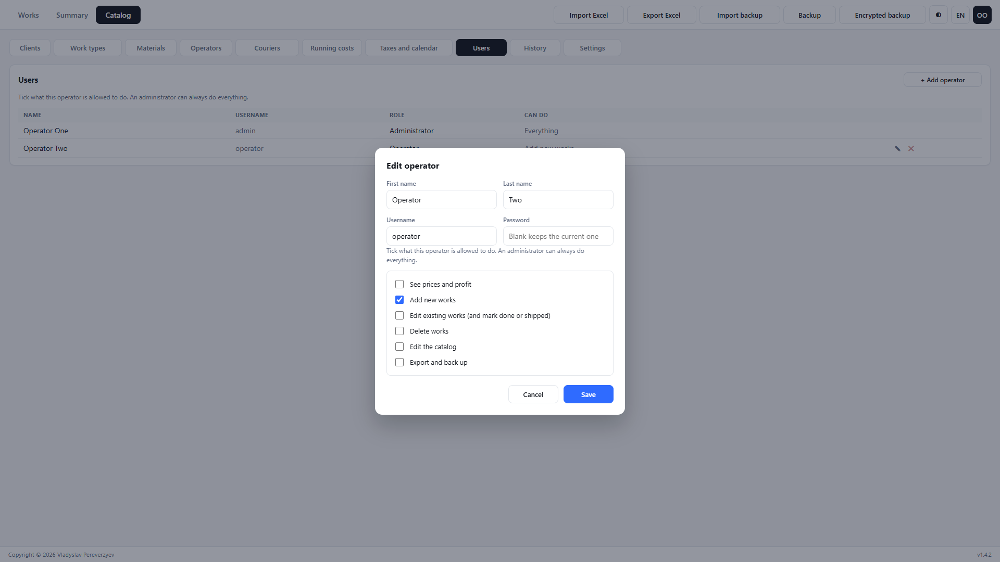
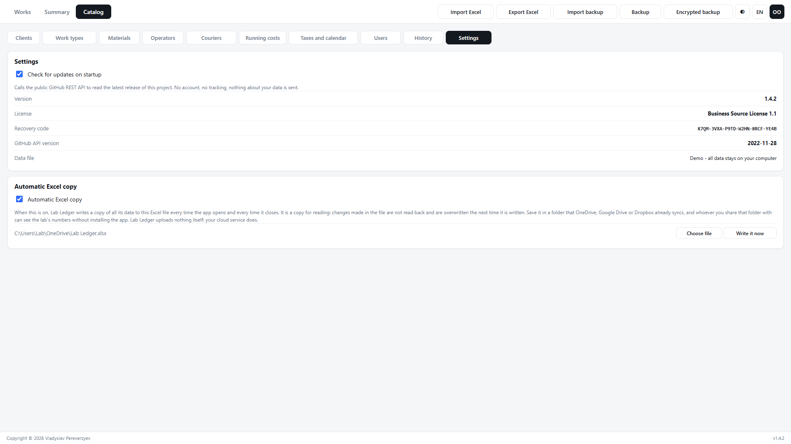

# Lab Ledger

[](https://github.com/vladpereverzyev/lab-ledger/releases/latest)
[](https://github.com/vladpereverzyev/lab-ledger/releases)
[](LICENSE)

[](#github-api)

[](./README.md)
[](./README.it.md)
[](./README.es.md)
[](./README.fr.md)
[](./README.de.md)

**Lab Ledger shows a dental lab what it really earns.**

Record each job as it comes in and goes out. Lab Ledger works out what it cost
in materials, adds rent, staff and taxes, and tells you the profit per year,
per month and per working day.

Free for Windows, macOS and Linux. No account, no subscription, and no internet
needed to use it: every number stays on your computer.

**[Download the app](https://github.com/vladpereverzyev/lab-ledger/releases/latest)** · **[Try it in your browser](https://vladpereverzyev.github.io/lab-ledger/)**

## Why Lab Ledger?

- **A real desktop program** - installed like any other, working without an
  internet connection, with nothing to sign up for.
- **Private by design** - all data stays on your computer. No patient or client
  data ships in the app; you type your own locally and back it up to files when
  you want.
- **Costs that are real** - a material is bought in a pack and yields a number
  of usable units. Divide, and you have the cost of one unit. A work type lists
  what it consumes, so changing one pack price updates every job that uses it.
- **The whole picture** - not just gross margin. Rent, energy, insurance,
  accountant, staff and taxes go in too, so the app can answer the only
  question that matters: what is left, per year, per month, per working day.

## Screenshots

First run - the lab's details and the administrator account, and nothing else to set up:



Works - every job with patient, shipping, material cost, price and margin:


The same screen in light mode - the theme button in the toolbar switches, and
the app opens light by default:


Summary - the year in cards, charts and a profit and loss:


Catalog - each work type wired to the materials it consumes:


Incoming - work still on the bench, which counts for nothing until it is marked done:



Users - what each operator may do, changeable at any time:



Settings - updates, the automatic Excel copy and the recovery code:



## Features

### Works
- Record each job: date, client, **patient** (full name or a case code), work type, units, who
  did it, and whether it is billable or a **redo**.
- **Redos are a loss, and are counted as one.** A redo is never invoiced: it
  burns the material and earns nothing, so its price column shows minus the
  material cost and it pulls the margin down exactly that much.
- **Shipping** - mark a job shipped with its date, courier and tracking number.
  Filter by shipped / still to ship.
- **Incoming and Outgoing** - work still on the bench waits in Incoming and
  counts for nothing yet; tick it done and it moves to Outgoing, where it earns
  and ships.
- **One parcel, many jobs** - tick several works and ship them together under a
  single date, courier and tracking number.
- **Deleting is not destroying** - a deleted work leaves every list and total
  but is kept in an archive inside the data file, so a backup still has it.
- Search across client, patient, work, operator, courier and tracking, and
  filter by year, month, operator, shipping and redo.

### Who uses it
- **First run** asks for the lab's details and creates the administrator. After
  that the app opens on a sign-in screen and nothing is behind it.
- **Operators** are added by the administrator, who ticks what each one may do
  and can change it at any time: see prices and profit, add new works, edit the
  works already recorded, delete them, edit the catalog, export and back up. An operator who cannot see the money gets no Summary tab,
  no price and margin columns, no prices in the catalog.
- **Passwords are never stored** - only PBKDF2-SHA256 over a random per-user
  salt, 150000 rounds. A forgotten password can be reset, never recovered.
- **A forgotten administrator password is not the end of the archive.** Setting
  the lab up produces a **recovery code**, shown once to be written down and
  kept, which resets the administrator password from the sign-in screen. A copy
  stays in the app's data folder on that computer, so it can be read back over
  the phone by whoever supports the lab - and an administrator can read it in
  **Catalog > Settings** at any time. The data file sitting next to it is plain
  JSON: the code is no more exposed than the archive it gets you back into, and
  both are protected by who is allowed to use that computer.
- **History** records every change with who made it and when: sign in and out,
  works added, edited, deleted, shipped or moved to outgoing, catalog and user
  changes. The administrator reads it in Catalog > History.

### Summary
- Activity cards: works, units, revenue, material cost, gross margin, redos and
  what the redos cost.
- Charts, all of them driven by your real rows: revenue and material cost by
  month (area), margin by month (bars, red when a month loses money),
  cumulative profit against the running-cost line, top work types by revenue
  (horizontal bars), revenue share by client (doughnut), works per operator
  split billable / redo (stacked bars), the work types each operator makes
  (stacked bars), and where the revenue goes (stacked
  bar: materials, running costs, taxes, what is left).
- Profitability cards: running costs, taxes and contributions, net profit, and
  the profit **per working day, per week, per month**, the average per work and
  the revenue you need just to break even.
- A **profit and loss** table with every line shown per year, per month, per
  working day and as a percentage of revenue.

### Catalog
- **Clients** - name, email, phone, VAT number, address, notes.
- **Materials** - pack cost, units per pack, the unit, a note. The cost per
  unit is the division, and it is shown on the row.
- **Work types** - each one lists the materials it uses and how many of each.
  The material cost is computed, never typed, and margin and margin % come with
  it.
- **Operators** and **couriers** - short lists you pick from.
- **Running costs** - property (rent, mortgage, service charges), energy
  (electricity, gas, water), insurance, accountant, staff and anything else,
  monthly or yearly, with the yearly and monthly figure on every row.
- **Taxes and calendar** - flat-rate or standard regime with plain percentages,
  plus how many days a week and weeks a year the lab actually works - which is
  what turns a yearly profit into a daily one.
- **Settings** - update check on or off, the automatic Excel copy, the recovery
  code (administrator only), version, licence and data file path.
- **Users** and **History** - accounts and permissions, and every change with
  who made it; administrator only.

### Everywhere
- **Import / Export** - Excel export of works, per-type summary, catalog and
  running costs; Excel import of works, from a sheet of your own or from a file
  Lab Ledger wrote; full backups, plain or **encrypted with a password**
  (AES-256-GCM), that restore on any computer. Restoring a backup replaces the
  accounts too, so only the administrator can do it.
- **Five languages**, and the toolbar does not move when you switch: every
  control has a fixed width.
- **Fits the screen it is on** - on a phone every table row becomes a card with
  each value labelled by its column, so a twelve-column list stays readable
  without pinching and scrolling sideways.
- **One dropdown everywhere** - every choice in the app opens the same rounded
  panel, instead of whatever list each operating system draws.
- **The euro sign always follows the number**, in every language; the thousands
  and decimal separators still follow the language.
- **Light by default**, dark a click away, remembered per computer.

## Offline by design

Lab Ledger needs no internet connection to work. Your data lives in one JSON
file on your computer: there is no account, no server, no telemetry, and
nothing you type is ever sent anywhere. The only way a copy of it leaves the
machine is one you choose yourself - putting the automatic Excel copy in a
folder your cloud drive syncs - and the app warns you before it writes one.

The app goes online for one reason only: **updates**. It then talks to the
public GitHub REST API, and only in these three cases:

- **the automatic check** - at most once a day, when the app starts, if the
  check is switched on. It is on by default; switch it off in
  **Catalog > Settings**;
- **a check by hand** - when you click the version number in the bottom-right
  corner of the window;
- **a download** - when you press **Download** in the update dialog.

None of them sends an account, an identifier or anything about your works,
clients or patients. Without a connection the app simply does not see new
versions; everything else works the same. The details are in
[GitHub API](#github-api).

## The automatic Excel copy

**What it is.** An ordinary Excel file (.xlsx) holding all the lab's numbers,
which Lab Ledger rewrites by itself every time the app opens and every time it
closes. It stays off until you switch it on in **Catalog > Settings** and choose
where the file goes.

**What it is for.** Seeing the numbers without the app. Anyone can open the file
- in Excel, Google Sheets, LibreOffice or Numbers, on a computer or a phone -
without installing anything.

**Sharing it through the cloud.** Save the file in a folder that OneDrive,
Google Drive or Dropbox already syncs, and that service uploads every new
version by itself: whoever you share the folder with - your accountant, a
partner - always finds the numbers up to date. Lab Ledger uploads nothing
itself; it only writes the file on your computer, and the upload is done by
your cloud service. Because the file holds all the data, the app asks you to
confirm before it starts writing it.

**It only goes one way.** The file is a copy for reading. Changes made in it are
not read back into Lab Ledger, and they are overwritten the next time the app
writes the file. To bring rows from a spreadsheet into the app, use
**Import Excel**, which adds them as new works.

**What is inside.** Eight sheets: works, the year month by month, materials with
the cost of one unit, work types with their materials and prices, running costs,
practices, operators, and an Info sheet with the version. Values only - no
macros, no formulas - and column widths already set, so it reads the same in
every program. Headers are in Italian when the app is set to Italian, and in
English otherwise.

## Languages

The app UI is available in **English, Italian, Spanish, French and German** -
switch with the language button in the toolbar. Adding a language is a
translation-only contribution: see [CONTRIBUTING.md](CONTRIBUTING.md).

## GitHub API

[](https://docs.github.com/rest)

Lab Ledger uses the **GitHub REST API** for one thing only: telling you that a
newer version exists.

| | |
|---|---|
| Endpoint | `GET /repos/vladpereverzyev/lab-ledger/releases/latest` |
| API version | `X-GitHub-Api-Version: 2022-11-28` |
| Authentication | none - the public, unauthenticated API |
| Rate limit | the public 60 requests per hour per IP; the app asks at most once a day |
| Sent | the request itself and a `User-Agent` of `LabLedger/<version>`. No account, no identifiers, nothing about your works, clients or patients |
| Received | the latest release tag, its page URL and the names of its files |
| Then what | the tag is compared with the installed version; if it is newer you get a dialog. Press **Download** and the app fetches the installer for your system straight into your Downloads folder, checks it against the SHA-256 sums published with the release - a file that does not match is deleted - and then offers to run it. Nothing is fetched and nothing is installed unless you press that button |

The automatic check can be switched off in **Catalog > Settings**. With it off,
the app only goes online when you click the version number in the bottom-right
corner of the window to check by hand, or press **Download**. The installed
version and the GitHub API version in use are both shown in Settings.

GitHub and the GitHub logo are trademarks of GitHub, Inc. Lab Ledger is an
independent project and is not affiliated with, sponsored by or
endorsed by GitHub.

## Where the data is stored

Your data lives in a single local JSON file inside the app's user-data folder -
the exact path is shown in **Catalog > Settings**. Nothing is uploaded anywhere.
Use **Backup** or **Encrypted backup** to save a copy and **Import backup** to
restore it.

Every save goes to a temporary file first and then replaces the old one, so a
crash or a power cut in the middle leaves the previous archive whole. If the
file ever cannot be read, the app moves it aside untouched - together with its
recovery code - and tells you where, instead of starting over on top of it.

## Run from source

Requires [Node.js](https://nodejs.org/) 22.12 or newer.

```bash
npm install
npm start
```

## Build

```bash
npm run dist
```

Installers are produced in the `release/` folder: NSIS installer and portable
`.exe` on Windows, a universal `.dmg` and `.zip` on macOS (Intel and Apple Silicon), `AppImage` and `.deb` on Linux.

Icons are regenerated from `build/icon.svg` with
[Pillow](https://pillow.readthedocs.io/):

```bash
python -m pip install pillow
python build/make-icons.py
```

## Tech

- [Electron](https://www.electronjs.org/) - desktop shell
- [Chart.js](https://www.chartjs.org/) - charts (bundled locally, no CDN)
- [SheetJS](https://sheetjs.com/) - Excel import/export
- [GitHub REST API](https://docs.github.com/rest) - update check

## Contributing

Contributions are welcome - especially translations. See
[CONTRIBUTING.md](CONTRIBUTING.md). Where the app could go next, written from
the bench rather than from the code: [docs/IDEAS.md](docs/IDEAS.md).

## License

Lab Ledger is **source-available**, not open source: free to use in your own
lab, not free to resell. It is covered by the
[Business Source License 1.1](LICENSE).

- **Any dental laboratory or practice may use it in production, free** - on as
  many computers and sites as you like.
- **What needs a commercial licence** is offering Lab Ledger, or a modified
  version of it, to third parties for money: as a product, a hosted service,
  bundled with hardware, or built into another product. Write to
  <info@vladpereverzyev.com>.
- **On 2030-09-14 this version becomes Apache 2.0** automatically. Every
  release carries its own change date, four years after it is published.
