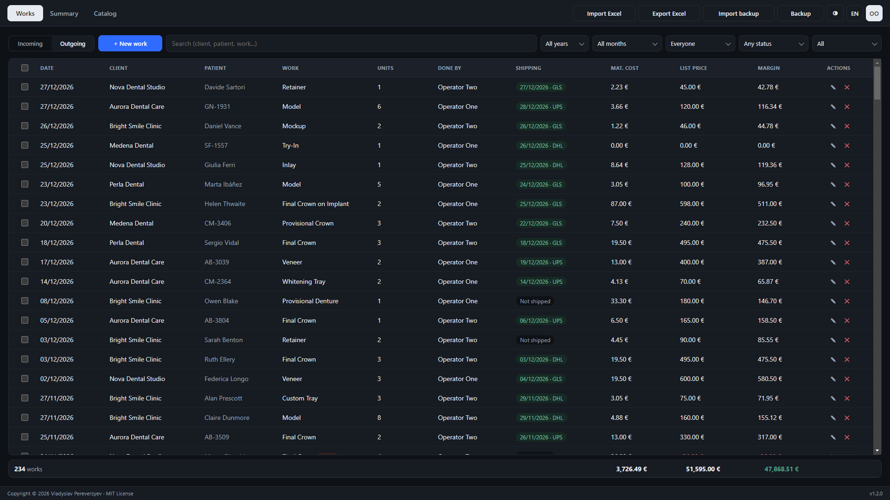
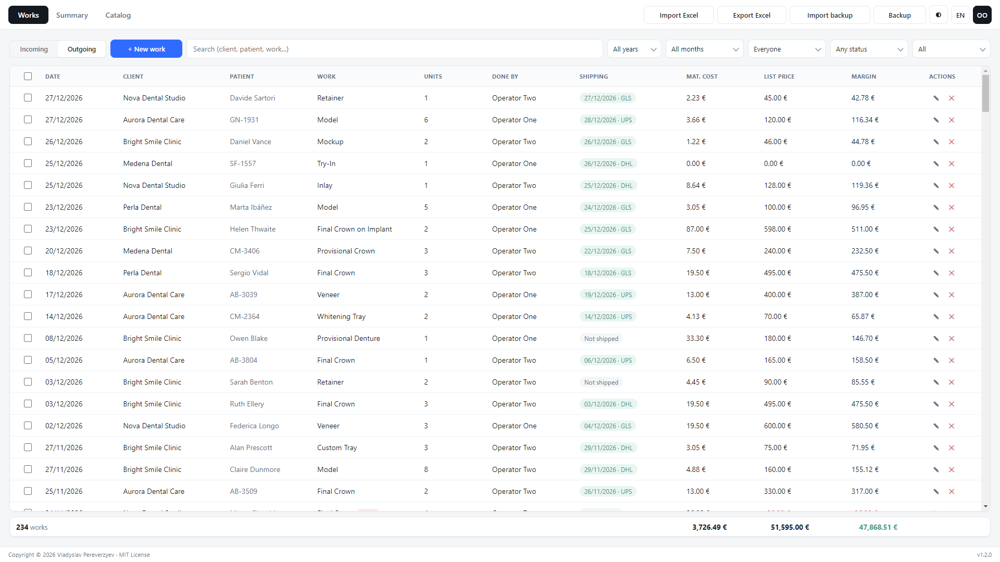
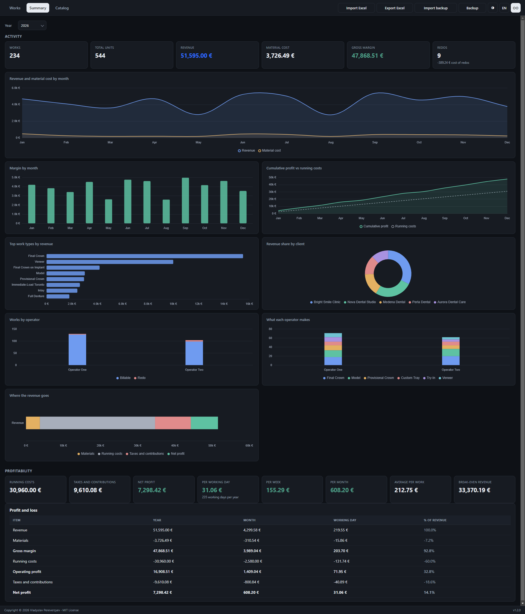
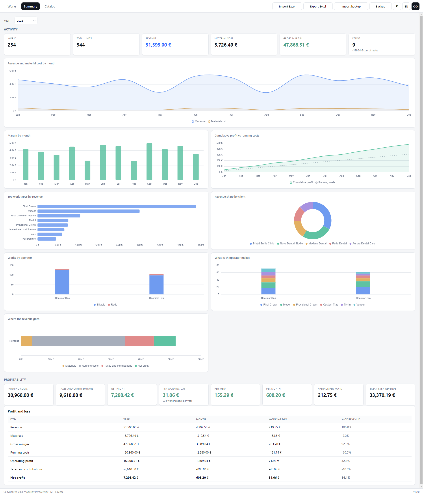
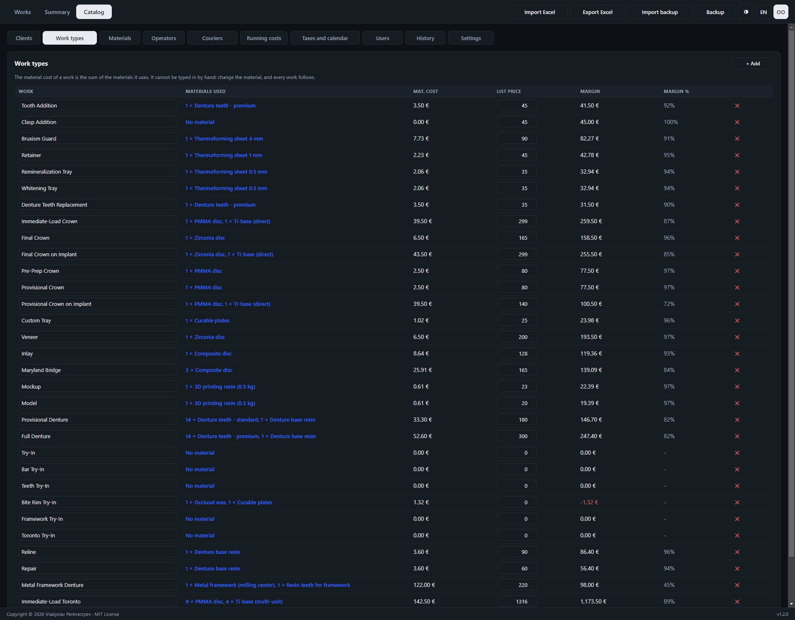
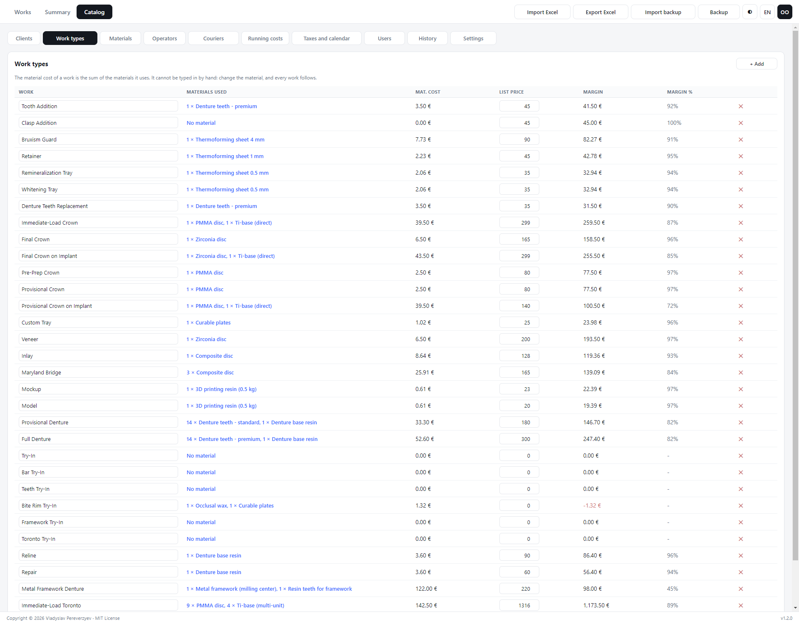

# Lab Ledger

[](https://github.com/vladpereverzyev/lab-ledger/releases/latest)
[](https://github.com/vladpereverzyev/lab-ledger/releases)
[](LICENSE)

[](#github-api)

[](./README.md)
[](./README.it.md)
[](./README.es.md)
[](./README.fr.md)
[](./README.de.md)

**A free, offline desktop app for dental labs** - record what leaves the bench,
and find out what is actually left at the end of the year.

<p align="center">
  
</p>

### [**Try the live demo**](https://vladpereverzyev.github.io/lab-ledger/)

Sample data, nothing to install - everything stays in your browser. Prefer the
real thing? Get the app from the
[latest release](https://github.com/vladpereverzyev/lab-ledger/releases/latest).

## Why Lab Ledger?

- **Free and offline** - no account, no server, no subscription. It packages
  into a real desktop app and runs like any normal program.
- **Private by design** - all data stays on your computer. No patient or client
  data ships in the app; you type your own locally and back it up to files when
  you want.
- **Costs that are real** - a material is bought in a pack and yields a number
  of usable units. Divide, and you have the cost of one unit. A work type lists
  what it consumes, so changing one pack price updates every job that uses it.
- **The whole picture** - not just gross margin. Rent, energy, insurance,
  accountant, staff and taxes go in too, so the app can answer the only
  question that matters: what is left, per year, per month, per working day.

## Screenshots

Works - every job with patient, shipping, material cost, price and margin:



The same screen in light mode - the theme button in the toolbar switches, and
the app opens light by default:



Summary - the year in cards, charts and a profit and loss:





Catalog - each work type wired to the materials it consumes:





## Features

### Works
- Record each job: date, client, **patient** (full name or a case code), work type, units, who
  did it, and whether it is billable or a **redo**.
- **Redos are a loss, and are counted as one.** A redo is never invoiced: it
  burns the material and earns nothing, so its price column shows minus the
  material cost and it pulls the margin down exactly that much.
- **Shipping** - mark a job shipped with its date, courier and tracking number.
  Filter by shipped / still to ship.
- Search across client, patient, work, operator, courier and tracking, and
  filter by year, month, operator, shipping and redo.

### Who uses it
- **First run** asks for the lab's details and creates the administrator. After
  that the app opens on a sign-in screen and nothing is behind it.
- **Operators** are added by the administrator, who ticks what each one may do:
  see prices and profit, add and edit works, delete them, edit the catalog,
  export and back up. An operator who cannot see the money gets no Summary tab,
  no price and margin columns, no prices in the catalog.
- **Passwords are never stored** - only PBKDF2-SHA256 over a random per-user
  salt, 150000 rounds. A forgotten password can be reset, never recovered.
- **History** records every change with who made it and when: sign in and out,
  works added, edited, deleted, shipped or moved to outgoing, catalog and user
  changes. The administrator reads it in Catalog > History.

### Summary
- Activity cards: works, units, revenue, material cost, gross margin, redos and
  what the redos cost.
- Charts, all of them driven by your real rows: revenue and material cost by
  month (area), margin by month (bars, red when a month loses money),
  cumulative profit against the running-cost line, top work types by revenue
  (horizontal bars), revenue share by client (doughnut), works per operator
  split billable / redo (stacked bars), and where the revenue goes (stacked
  bar: materials, running costs, taxes, what is left).
- Profitability cards: running costs, taxes and contributions, net profit, and
  the profit **per working day, per week, per month**, the average per work and
  the revenue you need just to break even.
- A **profit and loss** table with every line shown per year, per month, per
  working day and as a percentage of revenue.

### Catalog
- **Clients** - name, email, phone, VAT number, address, notes.
- **Materials** - pack cost, units per pack, the unit, a note. The cost per
  unit is the division, and it is shown on the row.
- **Work types** - each one lists the materials it uses and how many of each.
  The material cost is computed, never typed, and margin and margin % come with
  it.
- **Operators** and **couriers** - short lists you pick from.
- **Running costs** - property (rent, mortgage, service charges), energy
  (electricity, gas, water), insurance, accountant, staff and anything else,
  monthly or yearly, with the yearly and monthly figure on every row.
- **Taxes and calendar** - flat-rate or standard regime with plain percentages,
  plus how many days a week and weeks a year the lab actually works - which is
  what turns a yearly profit into a daily one.
- **Settings** - update check on or off, version, data file path.

### Everywhere
- **Import / Export** - Excel export of works, per-type summary, catalog and
  running costs; Excel import of works; full JSON backups you can restore on
  any computer.
- **Light and dark mode**, remembered per computer.
- **Five languages**, and the toolbar does not move when you switch: every
  control has a fixed width.
- **Fits the screen it is on** - on a phone every table row becomes a card with
  each value labelled by its column, so a twelve-column list stays readable
  without pinching and scrolling sideways.
- **One dropdown everywhere** - every choice in the app opens the same rounded
  panel, instead of whatever list each operating system draws.
- **The euro sign always follows the number**, in every language; the thousands
  and decimal separators still follow the language.
- **Light by default**, dark a click away, remembered per computer.

## Offline by design

Lab Ledger is not a cloud product with an offline mode. It is an offline
program, full stop. Your data lives in one JSON file on your computer; there is
no account, no server, no telemetry, and nothing you type ever leaves the
machine.

There is exactly one exception, and it is opt-out: **the update check**. Once a
day, if you leave it switched on, the app asks the public GitHub REST API which
release is the latest and compares it with the one you are running. That is the
only moment Lab Ledger uses the internet. It sends no account, no identifiers
and nothing about your works, clients or patients; and it downloads an
installer only when you press the button that asks for one. Switch it off in **Catalog > Settings** and the
app makes no network call at all. The details are in [GitHub API](#github-api).

## The companion Excel file

A lab already has a folder that syncs, and everyone around it can open a
spreadsheet without installing anything. So Lab Ledger writes one.

Point it at a file in **Catalog > Settings** and the app writes that workbook
every time it opens and every time it closes. Put it in the folder your cloud
drive already syncs and the lab's numbers travel with it - shareable by you,
with whoever you choose, without anybody installing the app. Lab Ledger itself
still uploads nothing: it only writes a local file, and your drive does the rest
if you want it to.

Eight sheets, all readable on their own: works, the year month by month,
materials with the cost of one unit, work types with their recipes and prices,
running costs, practices, operators, and an Info sheet with the version and the
copyright. Headers follow the language the app is set to.

It is deliberately a plain file: values only, no macros, no pivot tables, no
formulas only one program understands, column widths set so nothing shows as
####. Microsoft Excel, Google Sheets, LibreOffice and Numbers all open **and
edit** it the same way. Off by default.

## Languages

The app UI is available in **English, Italian, Spanish, French and German** -
switch with the language button in the toolbar. Adding a language is a
translation-only contribution: see [CONTRIBUTING.md](CONTRIBUTING.md).

## GitHub API

[](https://docs.github.com/rest)

Lab Ledger uses the **GitHub REST API** for one thing only: telling you that a
newer version exists.

| | |
|---|---|
| Endpoint | `GET /repos/vladpereverzyev/lab-ledger/releases/latest` |
| API version | `X-GitHub-Api-Version: 2022-11-28` |
| Authentication | none - the public, unauthenticated API |
| Rate limit | the public 60 requests per hour per IP; the app asks at most once a day |
| Sent | the request itself and a `User-Agent` of `LabLedger/<version>`. No account, no identifiers, nothing about your works, clients or patients |
| Received | the latest release tag and its page URL |
| Then what | the tag is compared with the installed version; if it is newer you get a dialog. Press **Download** and the app fetches the installer for your system straight into your Downloads folder, then offers to run it. Nothing is fetched and nothing is installed unless you press that button |

The check can be switched off in **Catalog > Settings**; with it off the app
makes no network calls at all. The installed version and the GitHub API version
in use are both shown there, and the version also sits in the toolbar - click it
to check for updates by hand.

GitHub and the GitHub logo are trademarks of GitHub, Inc. Lab Ledger is an
independent project and is not affiliated with, sponsored by or
endorsed by GitHub.

## Where the data is stored

Your data lives in a single local JSON file inside the app's user-data folder -
the exact path is shown in **Catalog > Settings**. Nothing is uploaded anywhere.
Use **Backup** to save a copy and **Import backup** to restore it.

## Run from source

Requires [Node.js](https://nodejs.org/) 18+.

```bash
npm install
npm start
```

## Build

```bash
npm run dist
```

Installers are produced in the `release/` folder: NSIS installer and portable
`.exe` on Windows, `.dmg` and `.zip` on macOS, `AppImage` and `.deb` on Linux.

Icons are regenerated from `build/icon.svg` with
[Pillow](https://pillow.readthedocs.io/):

```bash
python -m pip install pillow
python build/make-icons.py
```

## Tech

- [Electron](https://www.electronjs.org/) - desktop shell
- [Chart.js](https://www.chartjs.org/) - charts (bundled locally, no CDN)
- [SheetJS](https://sheetjs.com/) - Excel import/export
- [GitHub REST API](https://docs.github.com/rest) - update check

## How it was built

Lab Ledger is the work of a dental technician, not of a software house. Part of
the code was written with the help of Claude, Anthropic's AI assistant. The
decisions about what the app should do, the review of what came out, and the
testing at the bench are the author's, and so is the responsibility for the
result.

## Contributing

Contributions are welcome - especially translations. See
[CONTRIBUTING.md](CONTRIBUTING.md). Where the app could go next, written from
the bench rather than from the code: [docs/IDEAS.md](docs/IDEAS.md).

## License

Lab Ledger is **source-available**, not open source: free to use in your own
lab, not free to resell. Version 1.3.0 onwards is covered by the
[Business Source License 1.1](LICENSE).

- **Any dental laboratory or practice may use it in production, free** - on as
  many computers and sites as you like - and may pay someone to install, host,
  maintain or customise it.
- **What needs a commercial licence** is offering Lab Ledger, or a modified
  version of it, to third parties for money: as a product, a hosted service,
  bundled with hardware, or built into another product. Write to
  <info@vladpereverzyev.com>.
- **On 2030-09-11 this version becomes Apache 2.0** automatically. Every
  release carries its own change date, four years after it is published.
